# PawfectMatch

🐾 **PawfectMatch**  
PawfectMatch is a pet adoption and service booking platform built with Django. It allows users to browse adoptable pets, book professional pet services, and support local animal shelters. The platform combines clean UX, secure user accounts, and a modular backend to serve multiple real-world needs in one responsive web app.


---


📖 **Project Story**  
This application was developed as part of the Code Institute Level 5 Diploma in Web Application Development, fulfilling the criteria for the **Full Stack Frameworks with Django** Milestone Project (Project 4).

PawfectMatch was inspired by the growing demand for unified platforms that help animal lovers adopt responsibly and access trusted services. The app includes multi-app Django architecture, Stripe-ready integration, and secure user authentication. It is fully responsive and works seamlessly across desktop, tablet, and mobile.


---


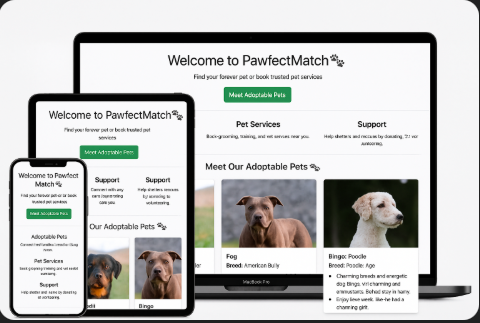


### 🖥️ Responsive Layout Preview

To ensure the best user experience across all devices, the PawfectMatch app was fully tested and designed using a mobile-first approach. The interface adapts to:

- 📱 Mobile screens (e.g., iPhone)
- 📲 Tablet views (responsive card layouts)
- 💻 Desktop screens (full-width layout)

Below are screenshots showing how the site renders across devices:


#### 📸 Mobile View
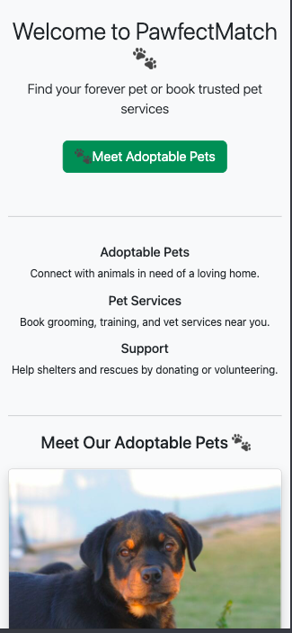

#### 💻 Tablet View
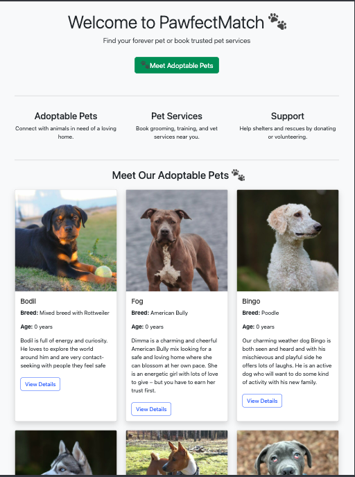

#### 🖥️ Desktop View
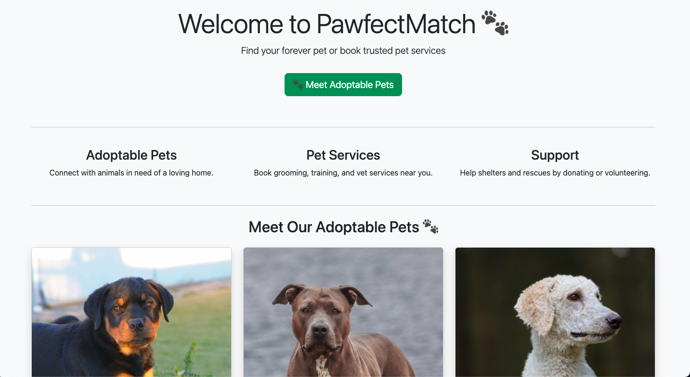

> These screenshots were taken on real devices using Chrome DevTools and demonstrate full responsiveness and layout adaptability.


🔗 The live site will be available here: **[Live Site - PawfectMatch](https://pawfectmatch-ok-c783577133e6.herokuapp.com/)**


---


## 📑 Table of Contents

- [User Experience Design](#user-experience-design)
  - [The Strategy Plane](#the-strategy-plane)
    - [Site Goals](#site-goals)
    - [Target Audience](#target-audience)
    - [User Stories (Agile)](#user-stories-agile)
  - [The Scope Plane](#the-scope-plane)
    - [Features Implemented](#features-implemented)
    - [Features Left to Implement](#features-left-to-implement)
  - [The Structure Plane](#the-structure-plane)
    - [Application Structure](#application-structure)
    - [URL Structure](#url-structure)
    - [Views & Templates](#views--templates)
    - [Authentication & Access Control](#authentication--access-control)
    - [Data Flow](#data-flow)
  - [The Skeleton Plane](#the-skeleton-plane)
    - [Wireframes](#wireframes)
    - [Database Design (ERD)](#database-design-erd)
    - [Security](#security)
  - [The Surface Plane](#the-surface-plane)
    - [Design Overview](#design-overview)
    - [Colour Scheme](#colour-scheme)
    - [Typography](#typography)
    - [Imagery](#imagery)
- [UI Preview](#-ui-preview)
- [Technologies Used](#technologies-used)
- [Agile Planning](#agile-planning)
- [Testing](#testing)
- [Deployment](#deployment)
- [Credits & Acknowledgments](#credits--acknowledgments)


---


## User Experience Design

### The Strategy Plane

#### Site Goals

The primary goal of PawfectMatch is to provide a trusted, user-friendly platform where:

- 🐶 Pet seekers can browse adoptable animals with photos and descriptions.
- 🐾 Registered users can book pet-related services like grooming, training, and veterinary appointments.
- 💖 Supporters can contribute through donations or volunteer signups.
- 🧑‍💻 Admins and staff can manage pet listings, services, and bookings via a secure admin dashboard.

The app supports the goals of both users and the platform owner (the shelter/service provider), enabling:

- Efficient connection between users and pet care providers.
- Centralized management of bookings, pets, and services.
- A potential revenue stream via Stripe payment integration.


#### Target Audience

- Individuals or families looking to adopt a pet.
- Pet owners searching for trusted services like grooming or training.
- Animal lovers who want to support local shelters via volunteering or donations.
- Admins managing shelter operations and service providers.

The platform is optimized for desktop, tablet, and mobile users, ensuring accessibility on all devices.


---


## User Stories (Agile)

This project followed the Agile methodology using GitHub Projects and Issues to plan and track development.

A total of **17 user stories** were created and organized into **4 main Epics**:

### Epics Overview

| Epic                             | Description                                                    |
|----------------------------------|----------------------------------------------------------------|
| **User Accounts & Authentication** | Account creation, login/logout, profile, and email confirmation |
| **Adoption Workflow**            | Browse, manage, and adopt pets (user and admin perspectives)   |
| **Pet Services & Bookings**      | View services, book appointments, pay via Stripe               |
| **Support & Community Sharing**  | Share site, volunteer, custom error handling, admin dashboard  |

All stories include clear Acceptance Criteria and were tracked using a **Kanban board** on GitHub.

🔗 **[View Agile Board on GitHub](https://github.com/users/Omar6688/projects/7)**


### Sample User Stories

Below are a few representative user stories from each Epic:


**👤 User Story: Register and Log In Easily**  
_As a new or returning user,_  
I want to register and log in easily  
So that I can book services or adopt pets.

✅ **Acceptance Criteria**:
- Registration form includes email, username, and password fields.
- Flash message appears confirming successful registration or login.
- Logged-in user is redirected to homepage with a welcome message.


**👤 User Story: Browse Adoptable Pets**  
_As a visitor,_  
I want to browse adoptable pets  
So that I can decide if I want to adopt one.

✅ **Acceptance Criteria**:
- Homepage or adoption page shows pet cards.
- Each pet has image, name, and description.
- Clicking a card shows full pet detail page.


**👤 User Story: Book a Service**  
_As a logged-in user,_  
I want to book a service online  
So that I can secure a slot for my pet.

✅ **Acceptance Criteria**:
- Booking form includes service, date, and message field.
- Form submission redirects to Stripe Checkout.
- Success page shows booking confirmation.


**👤 User Story: Share Site on Social Media**  
_As a user,_  
I want to share the site on social platforms  
So that I can help spread the word and support adoption.

✅ **Acceptance Criteria**:
- Share buttons available on homepage.
- Icons for Facebook, Instagram, and LinkedIn.
- Buttons open in a new tab.

For a full list of all 17 stories and their acceptance criteria, please refer to the Agile board linked above.


---


## The Scope Plane

### Features Implemented

The following features are included in the initial version of the **PawfectMatch** app:

#### 🐾 1. Home Page

- Introduces the site's purpose: pet adoption and pet services.
- Highlights core areas: Adopt, Services, and Support.
- Displays available pets dynamically with images and details.

#### 👤 2. User Authentication

- Full user registration, login, and logout using **django-allauth**.
- Redirects users after login and logout.
- Sign-up form includes email and password confirmation.

#### 📄 3. Pet Listings

- Pets are shown with name, age, breed, description, and image.
- Clicking a pet takes users to a detail page.

#### 🔍 4. Pet Detail Page

- Shows full details of an individual pet.
- Includes a button to apply for adoption (to be implemented).

#### 🛠️ 5. Pet Services App

- Users can browse available pet services (e.g., grooming, training).
- Services are listed with name, description, and price.

#### 📅 6. Booking Functionality

- Logged-in users can book a service by selecting a date and writing a message.
- CSRF protection and validation are included.
- Bookings saved to the database and displayed in the admin panel.

#### 💬 7. Support Page

- Allows users to send inquiries or support requests.
- Message is stored and viewable by admins via Django admin.

#### 🌐 8. Navigation Bar

- Contains links to Login, Logout, Sign Up, Services, and Support.
- Navigation adjusts based on authentication state.
- Fully responsive with Bootstrap.

#### 🔐 9. Admin Panel

- Admin can manage pets, services, bookings, and support inquiries.
- Superuser created for administrative tasks.

#### 📱 10. Responsive Design

- Uses Bootstrap 5 for mobile, tablet, and desktop responsiveness.
- Layout adapts to different devices gracefully.


### Features Left to Implement

These features are out of scope for this version but planned for future development:

- 📝 Adoption form submission and approval workflow.
- 📊 User dashboard showing bookings, adoption status, and profile details.
- 🔍 Search/filter for pets and services.
- 💳 Stripe payment integration for paid bookings or donations.
- 🗓️ Calendar view for appointments.
- 📈 Admin dashboard with charts for analytics.
- 💌 Email notifications for bookings and support submissions.
- 🌙 Dark mode UI toggle.
- 🖼️ Custom pet profiles with galleries and reviews.


---


## The Structure Plane

### Application Structure

The **PawfectMatch** project is built with Django and follows a modular app structure:

- `core`: Handles homepage, navigation, and shared templates (like `base.html`).
- `services`: Displays pet-related services.
- `bookings`: Manages service bookings (via forms and models).
- `support`: Allows users to send support messages.
- `templates/`: Contains app-specific HTML templates, all extending `base.html`.
- `static/`: Will hold custom CSS, JavaScript, and images.
- `media/`: Will be used for user-uploaded pet images (in future updates).

All Django apps are logically separated for clarity and reuse.


### URL Structure

The `urls.py` files are organized to include:

- `accounts/`: For authentication using django-allauth.
- `/`: The core homepage and dynamic pet listing.
- `/services/`: Lists available pet services.
- `/bookings/`: Booking form for logged-in users.
- `/support/`: Support/contact page.
- `admin/`: Django admin panel access for superusers.


### Views & Templates

- Each app contains its own views and templates.
- All templates extend `base.html`, which includes the navigation bar and Bootstrap.
- Views are function-based for clarity and simplicity.
- Templates use Django templating language to dynamically render content like pets and services.


### Authentication & Access Control

- Authentication is handled by **django-allauth**.
- Navigation adjusts based on whether the user is logged in.
- Certain views (like bookings) are protected and require login.


### Data Flow

- Pet data is passed from the `core` views into the homepage and pet detail pages.
- Booking data is submitted via a secure form and saved to the database.
- Admins can access all data via the Django admin panel.


---


## The Skeleton Plane

### Wireframes

Before development began, wireframes were created to plan the layout and user journey across the most important pages. These low-fidelity Balsamiq-style mockups helped map out responsive layouts, user interactions, and form placements across desktop, tablet, and mobile devices.

The wireframes ensured that the visual hierarchy and user flow aligned with the core goals of the application: promoting pet adoption, simplifying service bookings, and supporting shelter operations.

Each wireframe was used to guide the layout decisions during development and matches the final responsive design.

📸 **Final Wireframes**

| Page                                           | Preview                                                                        |
| ---------------------------------------------- | ------------------------------------------------------------------------------ |
| **Homepage** (Desktop, Tablet, Mobile)         | 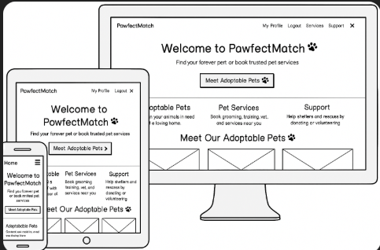             |
| **Adoptable Pets List** (Desktop)              | 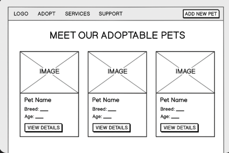 |
| **Pet Detail Page** (Desktop, Tablet, Mobile)  | 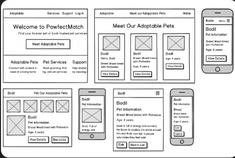     |
| **Booking Form** (Desktop)                     | 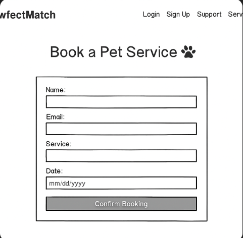 |
| **User Profile Page** (Desktop)                | 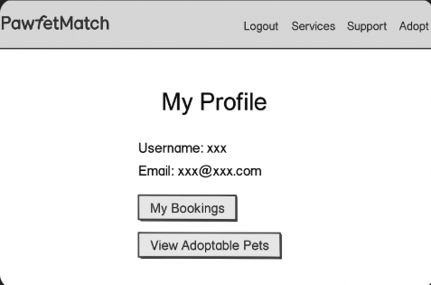      |

> _Note: These wireframes reflect the actual layout and responsive behavior of the live project and were created using Balsamiq-style mockups for visual clarity and planning._


### Database Design (ERD)

The following **Entity Relationship Diagram (ERD)** outlines the core data models and relationships used in the PawfectMatch Django application. Each model reflects a distinct part of the platform's functionality — such as pet adoption, service bookings, user messages, and authentication.

The diagram was created using [dbdiagram.io](https://dbdiagram.io) and is based on the actual Django models implemented in the project.

📸 **ERD Diagram Preview**

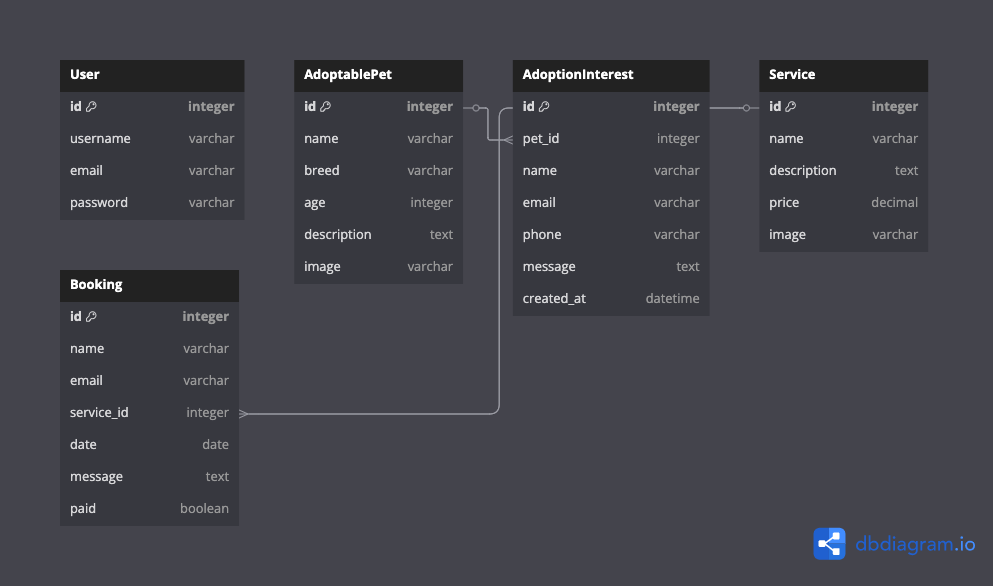


#### Model Overview

| Model              | Field        | Type             | Notes                                      |
|-------------------|--------------|------------------|---------------------------------------------|
| **AdoptablePet**   | name         | CharField        | Name of the adoptable pet                   |
|                   | breed        | CharField        | Breed of the pet                            |
|                   | age          | IntegerField     | Age in years                                |
|                   | description  | TextField        | Short bio or personality description        |
|                   | image        | ImageField       | Photo uploaded via admin                    |
|                   | created_at   | DateTimeField    | Auto-added when pet is listed               |
| **AdoptionInterest** | pet        | FK → AdoptablePet| Links interest to a pet                     |
|                   | name         | CharField        | Name of interested adopter                  |
|                   | email        | EmailField       | Contact email                               |
|                   | phone        | CharField        | Optional phone number                       |
|                   | message      | TextField        | Message expressing adoption interest        |
|                   | created_at   | DateTimeField    | Timestamp of the request                    |
| **Service**        | name         | CharField        | Name of the pet service (e.g., grooming)    |
|                   | description  | TextField        | Description of service                      |
|                   | price        | DecimalField     | Price of the service in USD                 |
|                   | image        | ImageField       | Optional visual for service                 |
| **Booking**        | name         | CharField        | Name of user submitting booking             |
|                   | email        | EmailField       | Email of user                               |
|                   | service      | FK → Service     | Selected service                            |
|                   | date         | DateField        | Booking date                                |
|                   | message      | TextField        | Optional user message                       |
|                   | paid         | BooleanField     | Stripe payment status                       |
|                   | created_at   | DateTimeField    | Auto-added timestamp                        |
| **SupportMessage** | name         | CharField        | Sender's name                               |
|                   | email        | EmailField       | Sender's email                              |
|                   | message      | TextField        | The message content                         |
|                   | created_at   | DateTimeField    | Auto timestamp                              |


All models are linked logically via **ForeignKey relationships**, and validation is handled at both the model and form levels. Sensitive fields like emails and payment status are properly stored and protected.


### Security

The following security best practices were implemented to protect user data and maintain integrity of the application:

- **Authentication & Authorization:** Implemented via `django-allauth` to manage user accounts.
- **Environment Variables:** All sensitive settings (e.g., `SECRET_KEY`, database credentials) are hidden using `.env` and `os.environ`.
- **Database Access:** Models such as Bookings are linked to individual users to ensure private access.
- **Custom Error Pages:** Friendly custom templates for 403, 404, and 500 errors to guide the user if issues occur.
- **CSRF Protection:** Enabled by default with Django middleware on all forms.
- **Input Validation:** Forms use Django’s built-in validation and widgets (e.g., date picker) to ensure correct inputs.


---


## The Surface Plane

### Design Overview

PawfectMatch is designed to be warm, welcoming, and user-friendly — reflecting the heart of pet adoption and support. The site uses generous white space, soft contrast, clear buttons, and mobile-first responsiveness to ensure an enjoyable experience on all screen sizes.

Design priorities included:

- A clean **centered layout** with balanced spacing
- Clear, bold **calls to action** (like "View Available Pets")
- Intuitive navigation across **Home**, **Services**, and **Support**
- Consistent use of **Bootstrap 5.3.3** for layout and styling


### Colour Scheme

The color palette of **PawfectMatch** is warm, accessible, and friendly — reflecting the welcoming tone of a pet adoption and care platform. Colors were selected to provide strong contrast, intuitive call-to-action highlights, and mobile readability.

| Element            | Color Code   | Purpose                                             |
|--------------------|--------------|-----------------------------------------------------|
| Background         | `#f8f9fa`    | Light gray used for overall background and sections |
| Navbar Background  | `#ffffff`    | Clean white for top navigation and base layout      |
| Primary Buttons    | `#198754`    | Bootstrap green (`btn-success`) used for CTAs       |
| Alert Highlights   | `#0d6efd`    | Bootstrap blue for flash messages and labels        |
| Danger Buttons     | `#dc3545`    | Bootstrap red used for delete actions               |
| Text               | `#212529`    | Very dark gray (almost black) for strong readability|
| Hover & Links      | `#0a58ca`    | Medium blue used for interactive states             |

> 🎨 All colors were chosen with accessibility in mind, ensuring proper contrast on both light and dark screens. Button colors were selected from the Bootstrap 5 utility palette for consistency and clarity.


### Typography

The site uses the default **Bootstrap typography system**, which ensures clean and responsive type sizing across all screen sizes:

- Font Family: **System font stack** for maximum compatibility
- Heading Sizes: Scalable based on viewport width (`h1` to `h5`)
- Body Text: Readable at `1rem` base size
- Alignment: Centered or left-aligned based on context

Readability was prioritized, especially for mobile users viewing pet details and service forms.


### Imagery

Images are central to the project’s emotional tone. Photos of pets are displayed in **cards** with soft shadows, rounded corners, and alt text for accessibility.

- 🐶 **Pet Images**: Shown on the homepage and pet detail page to highlight available animals for adoption.
- 📸 **Service Images**: Will be used to represent grooming, training, and veterinary services.
- 📂 All images are loaded via `image_url` fields and stored externally for performance.
- 🎯 Future optimization using tools like **TinyPNG** will improve performance.

> Note: All images are either owned or sourced from open-license repositories like [Unsplash](https://unsplash.com) or [Pexels](https://www.pexels.com). Each image will be properly credited in the README.


---


## UI Preview

Here are a few key screens from the live site:

| Homepage | Pet Detail Page | Booking Form |
|----------|------------------|----------------|
|  |  |  |

> _Ensure these screenshots exist in the `documentation/screens/` folder with matching filenames._


---


## Technologies Used

PawfectMatch leverages modern, reliable technologies across the front-end and back-end to ensure a responsive and dynamic user experience.

### Languages

- **HTML5** – For page structure and semantic markup.
- **CSS3** – For visual styling and responsive layout.
- **JavaScript (optional)** – For future dynamic frontend behavior.
- **Python 3.12** – Backend language for Django framework.


### Frameworks & Libraries

- **Django 5.2** – High-level Python web framework used for building models, views, and forms.
- **Django Allauth 65.7.0** – Integrated user authentication and registration.
- **Bootstrap 5.3.3** – CSS framework for responsive design and pre-styled components.
- **Gunicorn** – WSGI HTTP server used for production deployment.
- **WhiteNoise** – For efficient static file handling on Heroku.


### Databases

- **SQLite3** – Used during local development for simplicity.
- **PostgreSQL** – Production-grade relational database used on Heroku.


### Tools & Platforms

- **Visual Studio Code** – Main IDE for writing and editing code.
- **Git** – Version control for managing changes.
- **GitHub** – Remote code hosting, issues, and project planning (Agile board).
- **Heroku** – Hosting platform for live deployment.
- **Balsamiq** – For wireframe design and UX planning.
- **DrawSQL / dbdiagram.io** – For creating the ERD (Entity Relationship Diagram).
- **Chrome DevTools** – For layout debugging, Lighthouse testing, and accessibility checks.


### Other Utilities

- **pip** – Python package manager for installing project dependencies.
- **dotenv / env.py** – Local environment variable management.
- **Favicon.io** – For generating a custom site favicon.
- **Font Awesome** – Icon library for interface icons.
- **TinyPNG** _(planned)_ – To optimize and compress uploaded images.


### Python Dependencies

All Python dependencies are listed in the `requirements.txt` file and installed via:

```bash
pip install -r requirements.txt
asgiref==3.8.1
Django==5.2
django-allauth==65.7.0
sqlparse==0.5.3

```


---


## Agile Planning

This project was developed using the Agile methodology and GitHub Projects (Kanban board) to manage tasks and user stories effectively.

A total of **17 user stories** were written, grouped under **4 Epics**:

### Epics & User Story Themes

| Epic                               | Description                                                              |
| ---------------------------------- | ------------------------------------------------------------------------ |
| **User Accounts & Authentication** | Registration, login/logout, profile access, email confirmation           |
| **Adoption Workflow**              | Browse pets, add/delete listings (admin), adopt flow                     |
| **Pet Services & Bookings**        | View services, book, pay via Stripe, see bookings                        |
| **Support & Community Sharing**    | Volunteer info, social sharing, confirmations, and custom error handling |

Each story was created using GitHub Issues with a markdown-based user story template and included clear, testable **acceptance criteria** (3–5 per story).


### Agile Board Structure

The GitHub Project board followed a classic **Kanban** format with three main columns:

- **To Do** – All planned user stories
- **In Progress** – Tasks currently being developed
- **Done** – Completed and verified user stories

Issues were regularly updated and moved between columns throughout development to reflect real progress.


### Agile Board Screenshot

- Progress Stage:
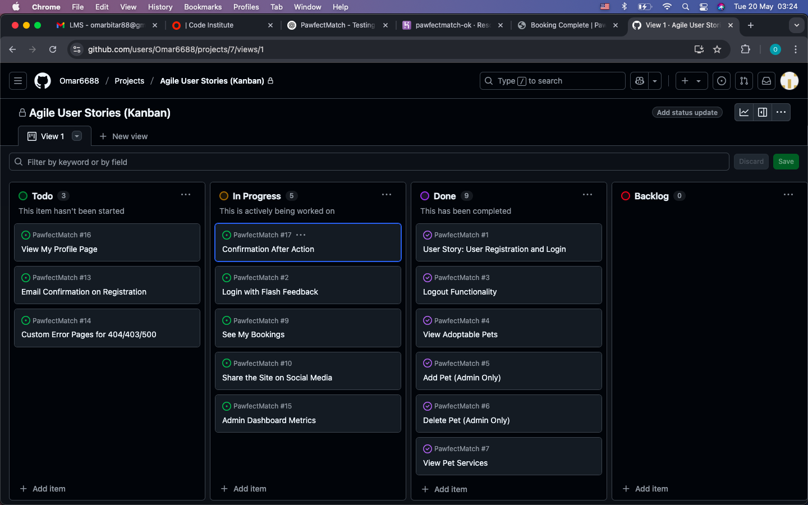

- Final Stage:
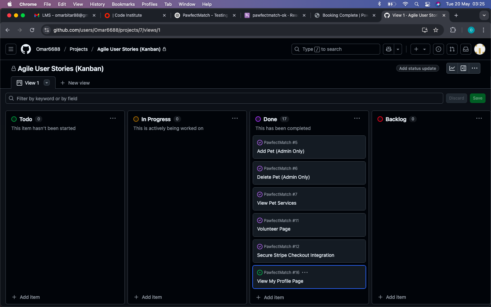


> 📝 _Be sure to update the image path above to match your actual screenshot filename and folder (e.g., `assets/images/agile-board.png` if you're storing it there)._


---


## Testing

Testing for this project has been fully documented in a dedicated file:

📄 **[View Full Testing Documentation](TESTING.md)**

It includes:

- Manual testing across all core features
- HTML and CSS validation (via W3C tools)
- JavaScript console checks
- Accessibility and Lighthouse performance tests
- Responsive layout testing on mobile, tablet, desktop
- Flake8 Python linting
- Bug fixing logs with before/after status
- Screenshots of key testing outputs


---


## Deployment

The **PawfectMatch** project was developed locally using `Visual Studio Code` and then deployed to **Heroku** using the Code Institute student template.

### Live Site

The project is live at:  
[https://pawfectmatch-ok-c783577133e6.herokuapp.com](https://pawfectmatch-ok-c783577133e6.herokuapp.com)


### Version Control & Hosting

- Git was used for local version control.
- The project was pushed to GitHub at regular intervals using descriptive commit messages.
- The repository is hosted at:  
  [https://github.com/Omar6688/PawfectMatch](https://github.com/Omar6688/PawfectMatch)


### How to Run Locally

To run the **PawfectMatch** project locally for development or testing, follow these steps:

1. **Clone the repository**:
    ```bash
    git clone https://github.com/Omar6688/PawfectMatch.git
    ```

2. **Navigate into the project directory**:
    ```bash
    cd PawfectMatch
    ```

3. **Create and activate a virtual environment**:
    ```bash
    python3 -m venv env
    source env/bin/activate
    ```

4. **Install required dependencies**:
    ```bash
    pip install -r requirements.txt
    ```

5. **Create a `.env` file in the root directory** and add your environment variables:
    ```env
    SECRET_KEY=your-secret-key
    DEVELOPMENT=True
    DEBUG=True
    ALLOWED_HOSTS=localhost,127.0.0.1
    STRIPE_PUBLIC_KEY=your-stripe-key
    STRIPE_SECRET_KEY=your-stripe-secret
    ```

6. **Apply database migrations**:
    ```bash
    python3 manage.py migrate
    ```

7. **Create a superuser account (optional but recommended)**:
    ```bash
    python3 manage.py createsuperuser
    ```

8. **Start the development server**:
    ```bash
    python3 manage.py runserver
    ```

9. **Open your browser and visit**:
    ```
    http://localhost:8000
    ```

You should now see the **PawfectMatch** homepage running locally! 🐾


### Heroku Deployment

The **PawfectMatch** project was deployed to Heroku using the Code Institute student template and Heroku CLI. Below are the detailed steps followed:


### Prerequisites

- GitHub repository set up with all project files.
- `requirements.txt`, `Procfile`, and `runtime.txt` present.
- Environment variables stored securely (locally in `.env`, and on Heroku dashboard).
- Heroku account with CLI installed.
- PostgreSQL add-on configured.


### 1️⃣ Prepare for Heroku

1. **Add required files**:
    - Create a `Procfile` (no file extension) with:
        ```text
        web: gunicorn pawfectmatch_project.wsgi
        ```
    - Ensure your `requirements.txt` is up to date:
        ```bash
        pip freeze > requirements.txt
        ```

2. **Install necessary packages** (already added):
    ```bash
    pip install gunicorn
    pip install dj-database-url psycopg2-binary
    pip install whitenoise
    ```

3. **Update `settings.py`**:
    - Set `ALLOWED_HOSTS` to include your Heroku domain.
    - Configure database with `dj-database-url`.
    - Use `os.getenv()` to load environment variables.
    - Add static/media file handling with WhiteNoise or AWS S3.


### 2️⃣ Create Heroku App

1. Log in to Heroku CLI:
    ```bash
    heroku login
    ```

2. Create the app:
    ```bash
    heroku create pawfectmatch-ok
    ```

3. Add Heroku remote to Git:
    ```bash
    heroku git:remote -a pawfectmatch-ok
    ```


### 3️⃣ Set Environment Variables on Heroku

In the **Heroku dashboard**, go to **Settings > Reveal Config Vars** and add the following:

| Key               | Value                    |
|------------------|--------------------------|
| SECRET_KEY        | your-django-secret-key   |
| DEBUG             | False                    |
| DEVELOPMENT       | False                    |
| USE_AWS           | True (if using AWS S3)   |
| STRIPE_PUBLIC_KEY | your-stripe-key          |
| STRIPE_SECRET_KEY | your-stripe-secret-key   |
| EMAIL_BACKEND     | django.core.mail.backends.smtp.EmailBackend |
| EMAIL_HOST        | smtp.gmail.com           |
| EMAIL_PORT        | 587                      |
| EMAIL_USE_TLS     | True                     |
| EMAIL_HOST_USER   | your-email@gmail.com     |
| EMAIL_HOST_PASSWORD | your-app-password      |


### 4️⃣ Deploy to Heroku

1. Push your code to Heroku:
    ```bash
    git push heroku main
    ```

2. Run migrations:
    ```bash
    heroku run python manage.py migrate
    ```

3. Create superuser on Heroku:
    ```bash
    heroku run python manage.py createsuperuser
    ```


### Live Site

The site is now live at:

🔗 [https://pawfectmatch-ok.herokuapp.com](https://pawfectmatch-ok-c783577133e6.herokuapp.com/)

You can log in using your test account or superuser credentials.


### Notes

- Static files are served via AWS S3.
- Allauth and Stripe are fully working on production.
- Debug mode is disabled in production.


---


## Credits & Acknowledgments

This project was developed as part of the **Code Institute Level 5 Diploma in Web Application Development**.

### Special Thanks

- **Gareth (My Mentor)** – A very special and sincere thank you to Gareth for his consistent guidance, encouragement, and expertise throughout this final project. His advice helped shape the project’s architecture, improve UX choices, and ensure a clear focus toward achieving a merit-level submission. As always, Gareth’s support went above and beyond, and I’m incredibly grateful for his mentorship.

- **Roman (Tutor Support)** – for helping resolve advanced AWS S3 and deployment issues with patience and clear solutions.

- **Code Institute** – for the structured curriculum, Django walkthroughs, and the excellent student support system, which made this full-stack project achievable.

- **Balsamiq** – used to create initial wireframe layouts in a user-focused and accessible format.

- **dbdiagram.io / DrawSQL** – used to generate the final Entity Relationship Diagram (ERD) for model planning and database logic.


### Image & Asset Sources

- **Pet images**: Placeholder animal images sourced from [Pexels](https://www.pexels.com) and [Unsplash](https://unsplash.com), licensed for free use with attribution.
- **Icons**: From [Font Awesome](https://fontawesome.com/) under their open-use license.
- **Favicon**: Generated using [Favicon.io](https://favicon.io/).


---


### Code Inspiration

- Some logic and setup steps were referenced from:
  - Django documentation: https://docs.djangoproject.com
  - Stripe’s official documentation
  - Community answers on [Stack Overflow](https://stackoverflow.com)
  - ChatGPT (OpenAI) – For helping shape this README, helping in solve bugs, and structure professional documentation. 
  - Blog tutorials from [Real Python](https://realpython.com)

Where code was reused or adapted, it has been clearly credited in-line or in the comments.

---

_This project is built for educational purposes only and is not intended for commercial deployment._
