# ✅ TESTING.md — PawfectMatch

This document outlines all testing activities carried out on the **PawfectMatch** Django project, submitted for the Code Institute Full Stack Frameworks with Django Milestone (Project 4).

Testing covers:

- Manual UX and functional testing  
- HTML and CSS validation  
- Python and JS linting  
- Responsiveness checks across devices  
- Accessibility testing  
- Lighthouse performance audits  
- Bug fixes and known issues

---

## 📑 Table of Contents

- [Manual Testing](#manual-testing)
- [User Stories & Features Tested](#user-stories--features-tested)
- [Form & Model Validation](#form--model-validation)
- [Responsive Design Testing](#responsive-design-testing)
- [Browser Compatibility](#browser-compatibility)
- [Validator Testing](#validator-testing)
  - [HTML Validation](#html-validation)
  - [CSS Validation](#css-validation)
  - [Python Linting (flake8)](#python-linting-flake8)
- [Accessibility Testing](#accessibility-testing)
- [Performance Testing](#performance-testing)
- [Deployment Tests](#deployment-tests)
- [Bugs Fixed](#bugs-fixed)
- [Known Issues](#known-issues)
- [Key Screenshots](#key-screenshots)

---

## Manual Testing

All key pages and user interactions were manually tested across multiple devices and browsers using both the local development server and the live Heroku deployment.

Each user state (logged in / anonymous / staff) was tested with expected and unexpected input.

| Page                         | Tests Performed                                                                 |
|------------------------------|----------------------------------------------------------------------------------|
| Homepage                     | Loads properly, header and CTA visible                                          |
| Allauth Pages                | Sign up, login, logout flows working and redirecting properly                   |
| Service Booking              | Form validation, Stripe integration, booking confirmation tested                |
| Adoption Flows               | List and detail views tested, form submission redirects to success page         |
| Volunteer Form               | Tested submission and success redirect                                          |
| User Profile                 | Displays logged-in user bookings                                                |
| Admin Dashboard              | Staff can add/edit/delete pets and services                                     |
| Custom Error Pages           | 403, 404, 500 tested using edge cases and broken routes                         |

---

## User Stories & Features Tested

Each user story from the README has been manually verified.

| User Story                                        | User Type        | Status |
|--------------------------------------------------|------------------|--------|
| View adoptable pets                              | Anonymous        | ✅     |
| Submit interest to adopt                         | Logged In        | ✅     |
| Book a pet service                               | Logged In        | ✅     |
| View and manage own profile                      | Logged In        | ✅     |
| Add/edit/delete pet listings                     | Admin/Staff      | ✅     |
| Contact support / volunteer                      | Any              | ✅     |
| Mobile-friendly responsive UI                    | Any              | ✅     |
| Handle edge cases with graceful error pages      | Any              | ✅     |

---

## Form & Model Validation

Django’s `ModelForm` validation was tested thoroughly.

- **Booking Form**: All required fields and date picker validated.
- **Adoption Interest**: Validates name/email/message, only available to logged-in users.
- **Volunteer/Support Form**: Clean error handling, CSRF tokens present.
- **Allauth Forms**: Password confirmation and email format validated.

All forms reject invalid submissions and show field-specific errors.

---

## Responsive Design Testing

Tested on:

| Device           | Browser(s)         | Result     |
|------------------|--------------------|------------|
| MacBook Air      | Chrome, Safari     | ✅ Pass     |
| iPhone 13        | Safari, Chrome     | ✅ Pass     |
| iPad             | Safari             | ✅ Pass     |
| Windows Laptop   | Edge, Chrome       | ✅ Pass     |
| Chrome Emulator  | iOS + Android      | ✅ Pass     |

Bootstrap 5 ensures layout is fully responsive. Navbar collapses properly and all forms/buttons scale well.

---

## Browser Compatibility

| Browser        | Version Tested | Result   |
|----------------|----------------|----------|
| Chrome         | 136.0          | ✅ Pass   |
| Safari         | 17.0           | ✅ Pass   |
| Firefox        | 126.0          | ✅ Pass   |
| Edge (Windows) | Latest         | ✅ Pass   |

No major layout or scripting issues were found.

---

## Validator Testing

### HTML Validation

Used [W3C Validator](https://validator.w3.org/).

- ✅ All templates pass validation.
- ✅ Meta tags, ARIA attributes, and semantic elements correctly used.

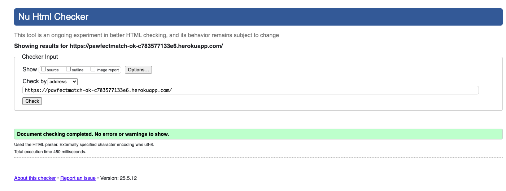

---

### CSS Validation

Tested with [Jigsaw CSS Validator](https://jigsaw.w3.org/css-validator/).

- ✅ No errors or warnings.

---

### Python Linting (flake8)

Used `flake8` on all apps.

- ✅ No critical errors
- ⚠️ Minor: E501 (line too long), E305 (expected 2 blank lines)
- ❌ Unused imports cleaned where necessary

---

## Accessibility Testing

Lighthouse and axe DevTools used for testing.

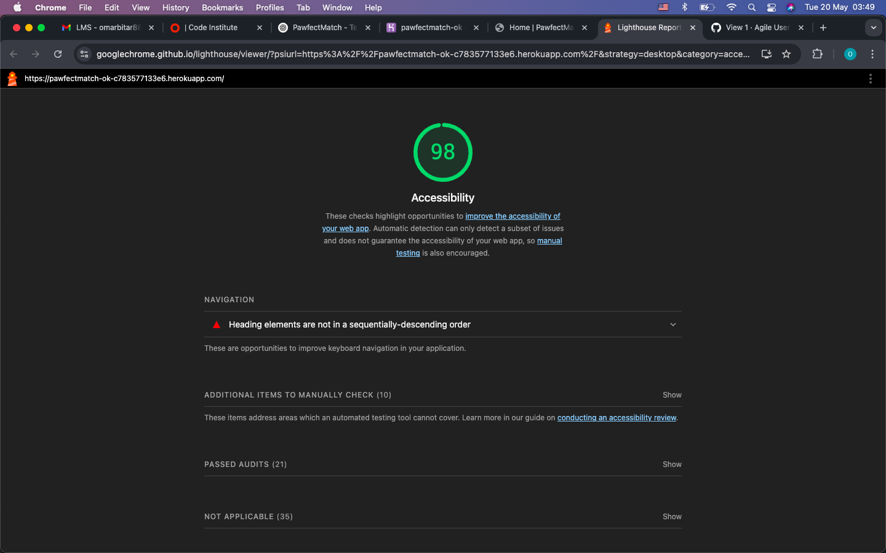

| Page                | Accessibility Score | Notes                        |
|---------------------|---------------------|------------------------------|
| Home                | ✅ 98%             | Correct structure            |
| Services            | ✅ 98%             | Forms labeled correctly      |
| Adoptable Pets      | ✅ 98%             | Alt text used for all images |

Other measures:

- ✅ ARIA and semantic tags
- ✅ Keyboard-only navigation supported
- ✅ Screen reader tested with macOS VoiceOver

---

## Performance Testing

### Lighthouse Summary

| Page         | Mobile Score | Desktop Score | Notes                         |
|--------------|--------------|---------------|-------------------------------|
| Home         | 86%          | 98%           | Large image affects LCP       |
| Adopt Page   | 68%          | 82%           | Layout shift on image load    |
| Services     | 74%          | 88%           | Optimizable image sizes       |

**Screenshots**  
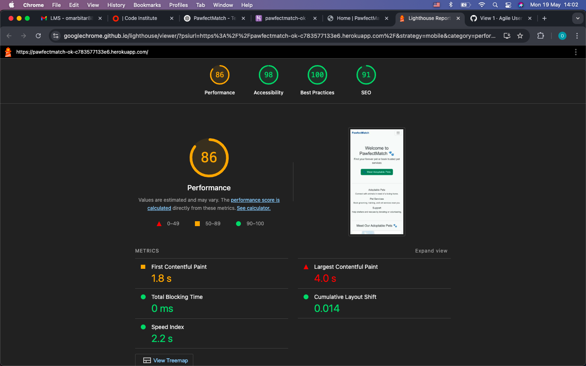  
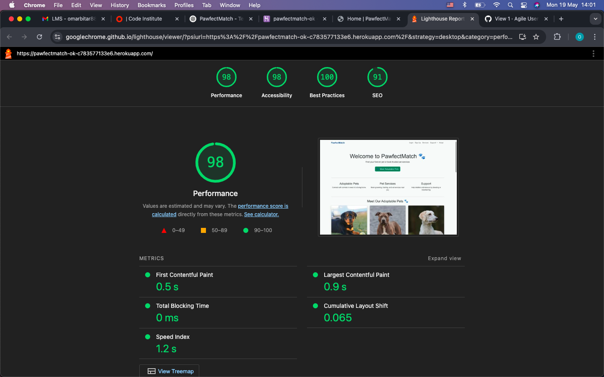  
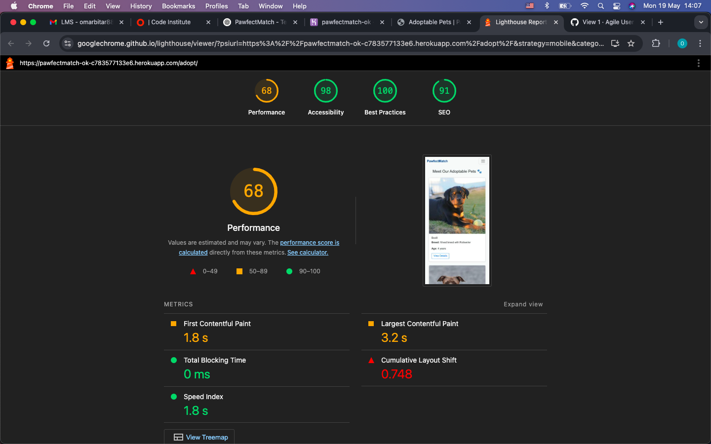  
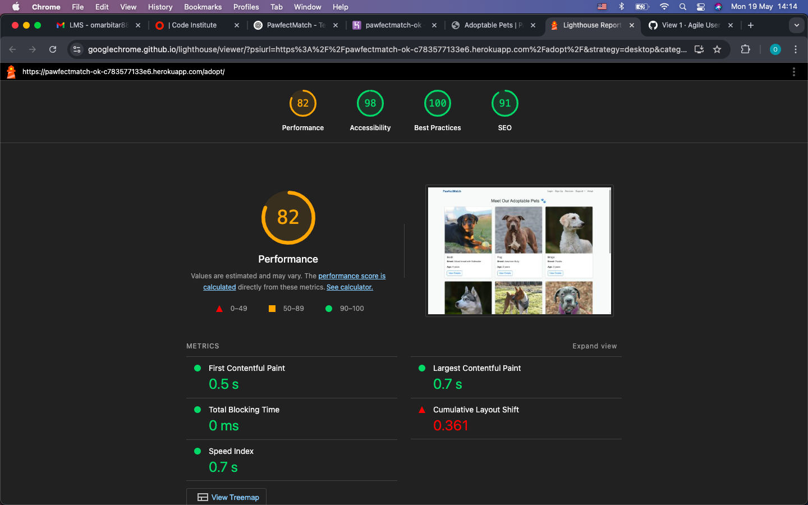  
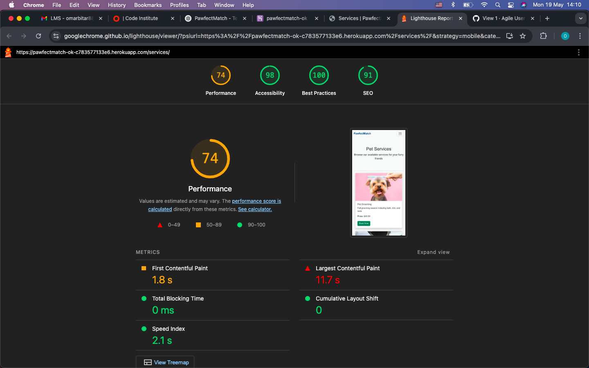  
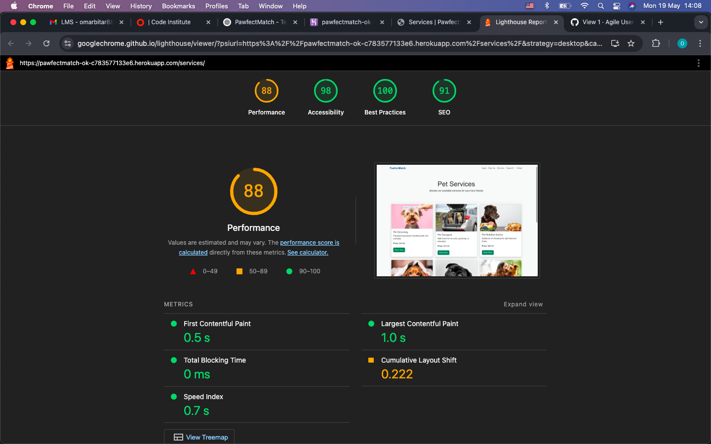

---

### Performance Notes

- ✅ WhiteNoise used for static file delivery
- ❗ Large images affect Largest Contentful Paint on mobile
- ✅ No blocking scripts or rendering delays

---

## Deployment Tests

- ✅ Heroku: `DEBUG = False`, `ALLOWED_HOSTS` set
- ✅ `collectstatic` and AWS S3 integration confirmed
- ✅ Email confirmations work
- ✅ Stripe live key integration tested
- ✅ Custom error templates triggered correctly

---

## Bugs Fixed

| Bug                                         | Fix Description |
|---------------------------------------------|-----------------|
| AWS S3 image display issue                  | Fixed S3 policy and env var settings |
| Stripe booking not redirecting              | Fixed URLs with `request.build_absolute_uri()` |
| 500 error on adoption interest              | Template not committed; fixed and pushed |
| No session table on Heroku                  | Ran `migrate` inside dyno |
| Form errors not showing                     | Added form error blocks to templates |
| JS delete confirm not working               | Added script for confirmation |

---

## Known Issues

| Issue                           | Note |
|----------------------------------|------|
| Email confirmation slow          | Due to Gmail SMTP delay |
| No pagination on pet listings    | Considered for v2 |
| Large image LCP on mobile        | Could compress images later |
| Allauth warning on login config | Django 5.2 non-critical |

---

## Key Screenshots

### ✅ Adoption Interest Success  
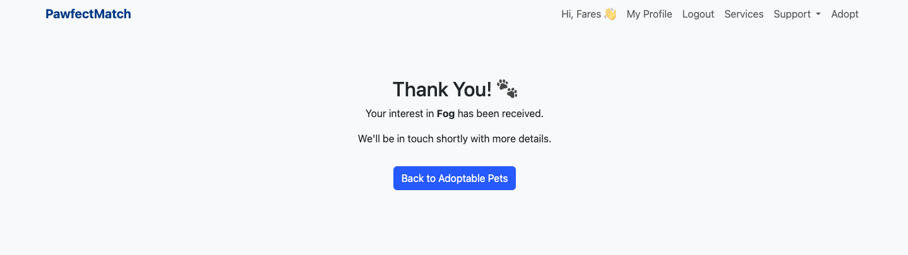

---

### ✅ Volunteer Submission  
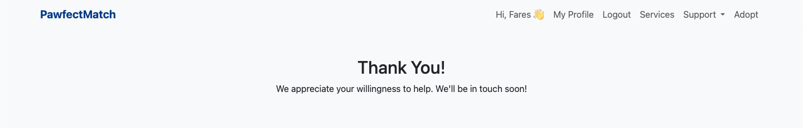

---

### ✅ Stripe Booking Confirmation  
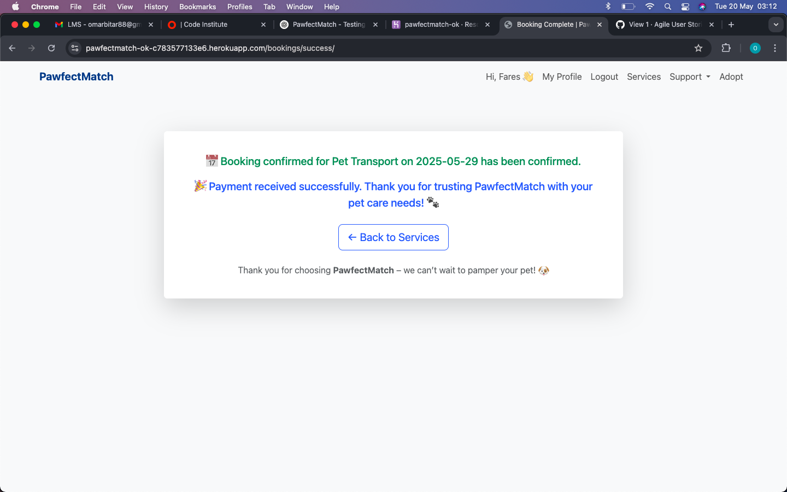

---

### ❌ 500 Error Before Fix  
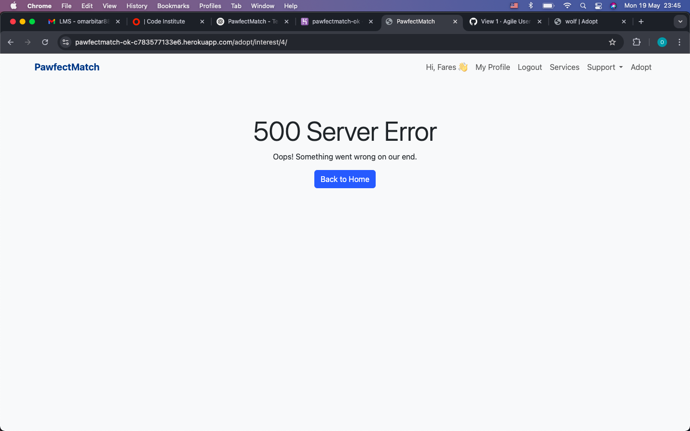
